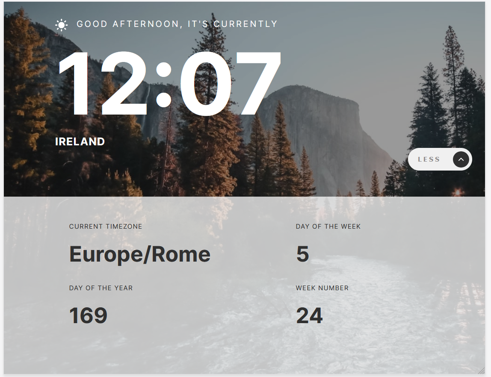

# Frontend Mentor - Clock app solution

This is a solution to the [Clock app challenge on Frontend Mentor](https://www.frontendmentor.io/challenges/clock-app-LMFaxFwrM). Frontend Mentor challenges help you improve your coding skills by building realistic projects. 

## Table of contents

- [Overview](#overview)
  - [The challenge](#the-challenge)
  - [Screenshot](#screenshot)
  - [Links](#links)
  - [Built with](#built-with)
  - [Author](#author)

## Overview

### The challenge

Users should be able to:

- View the optimal layout for the site depending on their device's screen size
- See hover states for all interactive elements on the page
- View the current time and location information based on their IP address
- View additional information about the date and time in the expanded state
- Be shown the correct greeting and background image based on the time of day they're visiting the site
- Generate random programming quotes by clicking the refresh icon near the quote

### Screenshot

### Links

- Live Site URL: [View live page here](https://clock-app-six.vercel.app/)

### Built with

- Semantic HTML5 markup
- CSS custom properties
- Flexbox
- CSS Grid
- Sass Preprocessor
- Mobile-first workflow
- Jquery

## Author

- Frontend Mentor - [@Da-vi-de](https://www.frontendmentor.io/profile/Da-vi-de)
